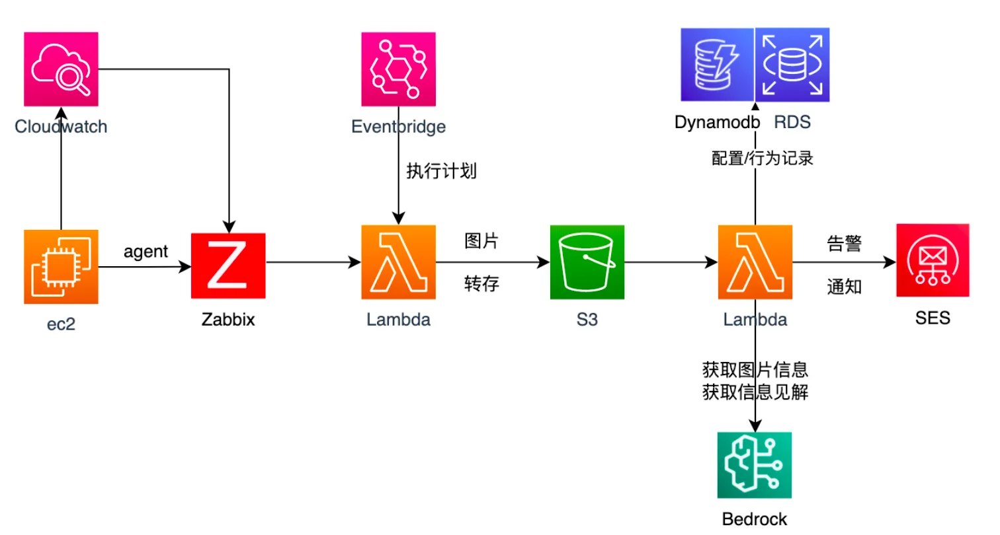

# Zabbix 智能巡检系统

基于AWS Lambda和大语言模型的Zabbix监控数据智能分析系统

## 系统架构



## 项目简介

本项目是一个基于AWS Lambda和大语言模型的智能运维解决方案，通过自动化的方式对Zabbix监控系统中的数据进行智能分析和预警。系统能够自动获取Zabbix监控视图，利用大语言模型进行数据理解和分析，从而实现智能化的预警机制。

## 文件结构

```
zabbix-intelligent-inspection/
├── README.md                 # 项目说明文档
├── image/                    # 系统架构图目录
├── zabbix-function-call/     # Lambda函数调用模块
└── zabbix-intelligent-inspection/  # 核心实现目录
    ├── claude_handler.py     # 大语言模型处理
    ├── config.py            # 配置管理
    ├── hosts_conf.ini       # 主机配置
    ├── lambda_function.py   # 主程序入口
    ├── models.py           # 数据模型
    ├── ses_handler.py      # 邮件服务
    ├── zabbix_conf.ini     # Zabbix配置
    ├── zabbix_handler.py   # Zabbix API处理
    └── templates/          # 邮件模板目录
```

## 核心组件功能

### 1. 主程序入口 (lambda_function.py)
- 系统主入口，协调各组件工作
- 处理主机监控数据收集
- 触发智能分析流程
- 处理告警邮件发送

### 2. Zabbix处理模块 (zabbix_handler.py)
- 实现与Zabbix API的交互
- 获取监控数据和图表
- 下载监控图表
- 处理监控数据的格式化

### 3. 大语言模型处理 (claude_handler.py)
- 集成AWS Bedrock的Claude模型
- 提供图像识别功能
- 提供监控数据智能分析
- 使用两个不同的模型：
  - nova-lite-v1用于图像识别
  - nova-pro-v1用于数据分析

### 4. 配置管理
- hosts_conf.ini：主机配置信息
- zabbix_conf.ini：Zabbix服务器配置
- config.py：配置文件加载和处理

### 5. 邮件通知 (ses_handler.py)
- 使用AWS SES服务
- 发送告警邮件
- 使用HTML模板格式化邮件内容

## 工作流程

1. Lambda函数触发后，从配置文件获取需要监控的主机列表
2. 对每个主机：
   - 通过Zabbix API获取监控数据和图表
   - 使用Claude模型分析监控图表
   - 生成智能分析报告
3. 如果发现异常：
   - 收集异常信息
   - 通过SES发送告警邮件
4. 清理临时文件并完成执行

## 场景和优势
基于Zabbix的智能巡检解决方案能够有效应对多种监控场景，并为IT运维带来显著优势：
###场景1: 高频核心组件监控**
- 该方案实现了对关键系统组件的高频率实时监控，每10-15分钟捕获一次核心指标数据。通过大语言模型（claude3.5 sonnet）识别异常模式和潜在风险，实现预防性通知告警。这种主动式监控策略可显著提升了异常发现的及时性，减少了意外宕机的可能性。
###场景2: 时间段整体指标分析**
- 除实时监控外，该方案还可以设置12-24小时为周期的中长期指标分析功能。通过对特定时间段内的综合指标进行深度挖掘和趋势分析，揭示隐藏的资源使用模式和潜在的性能瓶颈。这种全面的分析视角使运维团队能够制定更加精准的资源优化策略，提前应对可能出现的系统压力。
###场景3: 性能测试辅助分析**
- 在性能测试领域，通过保存每个测试阶段的详细指标视图，并结合先进的大语言模型技术，系统能够自动对比不同测试周期的性能指标，精确定位性能退化点或改进区域。这一功能大大提高了性能测试的效率和准确性，为优化系统性能提供了数据驱动的决策支持。
###优势1: 先进的Serverless架构**
- 采用最新的Serverless架构，该解决方案不仅降低了基础设施维护成本，还实现了卓越的可靠性和灵活的扩展能力。这种架构设计使系统能够自动适应负载变化，在保证高性能的同时优化资源利用，为企业带来显著的成本效益。
###优势2: 灵活简便的配置管理**
- 该方案采用了创新的配置管理方式，只需维护主机IP和监控视图名称即可快速完成系统集成。这种简化的配置流程大大降低了运维复杂度，同时保留了针对不同服务类型定制化监控策略的灵活性。通过智能化的prompt设置，系统能够精确适配各种服务的独特监控需求。
###优势3: 智能化运维操作**
- 突破传统的单一指标、单一主机的预警设置模式，该方案实现了指标异常识别的通用化和智能化。通过机大语言模型识别异常行为，减少误报率，同时提高了真实问题的检测效率。
