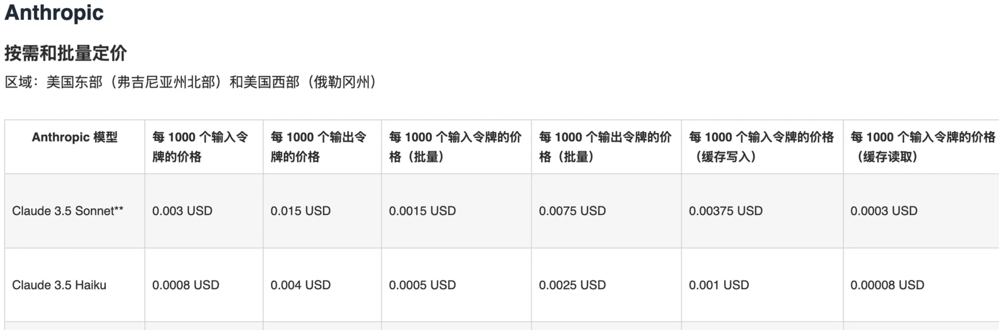
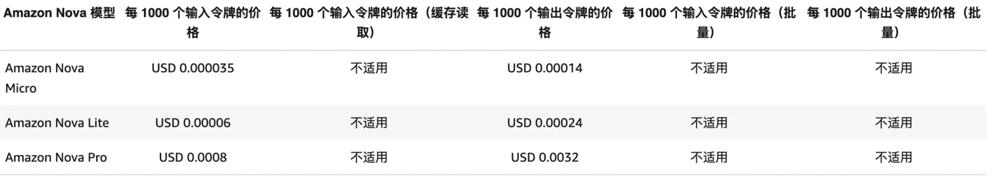

# Zabbix 智能巡检系统

基于AWS Lambda和大语言模型的Zabbix监控数据智能分析系统

## 系统架构


## 项目简介

本项目是一个基于AWS Lambda和大语言模型的智能运维解决方案，通过自动化的方式对Zabbix监控系统中的数据进行智能分析和预警。系统能够自动获取Zabbix监控视图，利用大语言模型进行数据理解和分析，从而实现智能化的预警机制。

## 项目结构

本项目包含两个主要模块：

1. [Lambda函数调用模块](zabbix-function-call/README.md)
   - 负责定时触发监控任务
   - 支持单主机和多主机巡检
   - 处理Lambda函数的调用参数

2. [智能巡检核心模块](zabbix-intelligent-inspection/README.md)
   - 实现监控数据采集和分析
   - 集成大语言模型处理
   - 提供邮件告警功能

详细的文件结构如下：
```
zabbix-intelligent-inspection/
├── README.md                 # 项目说明文档
├── image/                    # 系统架构图目录
├── zabbix-function-call/     # Lambda函数调用模块
└── zabbix-intelligent-inspection/  # 核心实现目录
    ├── claude_handler.py     # 大语言模型处理
    ├── config.py            # 配置管理
    ├── hosts_conf.ini       # 主机配置
    ├── lambda_function.py   # 主程序入口
    ├── models.py           # 数据模型
    ├── ses_handler.py      # 邮件服务
    ├── zabbix_conf.ini     # Zabbix配置
    ├── zabbix_handler.py   # Zabbix API处理
    └── templates/          # 邮件模板目录
```

## 场景和优势
基于Zabbix的智能巡检解决方案能够有效应对多种监控场景，并为IT运维带来显著优势：
### 场景1: 高频核心组件监控
- 该方案实现了对关键系统组件的高频率实时监控，每10-15分钟捕获一次核心指标数据。通过大语言模型（claude3.5 sonnet）识别异常模式和潜在风险，实现预防性通知告警。这种主动式监控策略可显著提升了异常发现的及时性，减少了意外宕机的可能性。
### 场景2: 时间段整体指标分析
- 除实时监控外，该方案还可以设置12-24小时为周期的中长期指标分析功能。通过对特定时间段内的综合指标进行深度挖掘和趋势分析，揭示隐藏的资源使用模式和潜在的性能瓶颈。这种全面的分析视角使运维团队能够制定更加精准的资源优化策略，提前应对可能出现的系统压力。
### 场景3: 性能测试辅助分析
- 在性能测试领域，通过保存每个测试阶段的详细指标视图，并结合先进的大语言模型技术，系统能够自动对比不同测试周期的性能指标，精确定位性能退化点或改进区域。这一功能大大提高了性能测试的效率和准确性，为优化系统性能提供了数据驱动的决策支持。
### 优势1: 先进的Serverless架构
- 采用最新的Serverless架构，该解决方案不仅降低了基础设施维护成本，还实现了卓越的可靠性和灵活的扩展能力。这种架构设计使系统能够自动适应负载变化，在保证高性能的同时优化资源利用，为企业带来显著的成本效益。
### 优势2: 灵活简便的配置管理
- 该方案采用了创新的配置管理方式，只需维护主机IP和监控视图名称即可快速完成系统集成。这种简化的配置流程大大降低了运维复杂度，同时保留了针对不同服务类型定制化监控策略的灵活性。通过智能化的prompt设置，系统能够精确适配各种服务的独特监控需求。
### 优势3: 智能化运维操作
- 突破传统的单一指标、单一主机的预警设置模式，该方案实现了指标异常识别的通用化和智能化。通过机大语言模型识别异常行为，减少误报率，同时提高了真实问题的检测效率。

## 成本说明
假设一台主机需要提取CPU + Memory实现智能巡检

### claude3.5 sonnet v2 图片信息提取, claude3.5 sonnet v2 多模态，图片按照像素大小进行收费，建议配置选择使用400*100大小
- 基于日志记录数值，大体使用量为
- input token = 675
- output token = 318
- 价格 = 675/1000*0.003++318/1000*0.015 = 0.006795$
### claude3.5 sonnet v2 指标分析
- 基于日志记录数值，大体使用量为
- input token = 550
- output token = 50（平均值，绝大部分时候为巡检正常）
- 价格 = 550/1000*0.003+50/1000*0.015 = 0.0024$
- 因此一个host 巡检执行完 大致为 0.006795$ + 0.0024$ = 0.009195$


### nova lite 图片信息提取，nova 按图片数量收费，建议配置选择使用800*200大小
- input token = 1623
- output token = 311
- 价格 = 1623/1000*0.00006+311/1000*0.00024 = 0.00017202$
### nova pro 指标分析
- input token = 542
- output token = 50（平均值，绝大部分时候为巡检正常）
- 价格 = 542/1000*0.0008+50/1000*0.0032 = 0.0005936$
- 因此一个host 巡检执行完 大致为 0.00017202$ + 0.0005936$ = 0.00076562$


